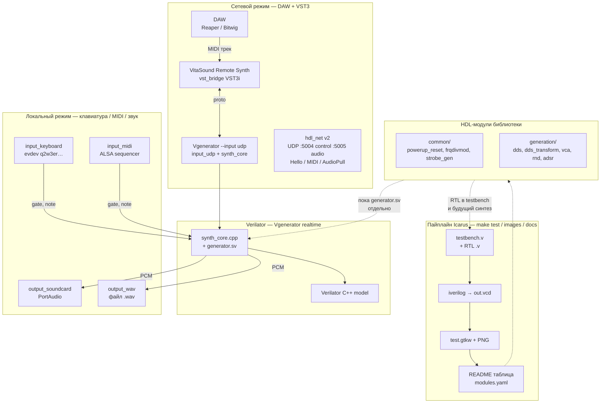
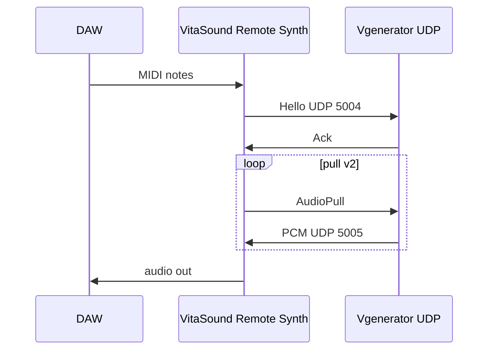

# Архитектура hdl-modules

Общая карта: библиотека RTL, симуляция в Icarus, реалтайм через Verilator и сетевой мост в DAW.



## Три уровня тестирования

| Уровень | Инструмент | Что проверяем | Артефакт |
|---------|------------|---------------|----------|
| **Модульный RTL** | Icarus Verilog | Один `.v` или пакет в изоляции | `test.png`, waveform в README |
| **Реалтайм на ПК** | Verilator + C++ | Тот же алгоритм под реальным clock, звук сразу | Наушники / WAV |
| **Через DAW** | VST3 + UDP engine | MIDI и PCM как в продакшене VitaSound | Reaper + `Vgenerator` |

## Локальный режим (`verilator_tests`)

```bash
cd verilator_tests && make
./obj_dir/Vgenerator                          # keyboard → soundcard
./obj_dir/Vgenerator --input midi --output wav  # MIDI → файл
```

| Ввод | Вывод | Назначение |
|------|-------|------------|
| `input_keyboard` | `output_soundcard` | Живая клавиатура PC → колонки |
| `input_midi` | `output_soundcard` / `output_wav` | MIDI-клавиатура / секвенсер |
| `input_udp` | (PCM по AudioPull) | Тот же synth, управление из VST |

Поток: **событие** (клавиша / MIDI note) → `shared_state` (`gate`, `note`) → **Verilog** `generator.sv` → **PCM** → PortAudio или WAV.

## Сетевой режим (UDP + VST)

```bash
./scripts/run_udp_engine.sh          # engine в WSL/Linux
# VST: Engine host = IP WSL или 127.0.0.1 (native engine)
```



Подробнее: [vst_bridge/README.md](vst_bridge/README.md), [docs/WSL_NETWORKING.md](docs/WSL_NETWORKING.md).

## Где что лежит

| Путь | Роль |
|------|------|
| `common/`, `dds/`, `vca/`, … | Исходники RTL + `*_test/` |
| `modules.yaml` | Метаданные для `make docs` |
| `tools/run_tests.py`, `make test` | Запуск Icarus по всем модулям |
| `verilator_tests/generator.sv` | Топ синтезатора для Verilator |
| `verilator_tests/input_*.cpp` | Адаптеры ввода ОС |
| `verilator_tests/output_*.cpp` | Адаптеры вывода ОС |
| `vst_bridge/` | VST3-плагин (хост в DAW) |
| `verilator_tests/protocol/hdl_net.h` | Протокол UDP (копия в `vst_bridge/protocol/`) |

## Связь с будущей ПЛИС

Библиотека `hdl-modules` — источник блоков для VitaSound FPGA. Сейчас `generator.sv` в Verilator — упрощённый MVP; модули `dds`, `adsr`, `vca` отрабатываются в Icarus и постепенно войдут в полный синтезатор на железе и в Verilator-top.
