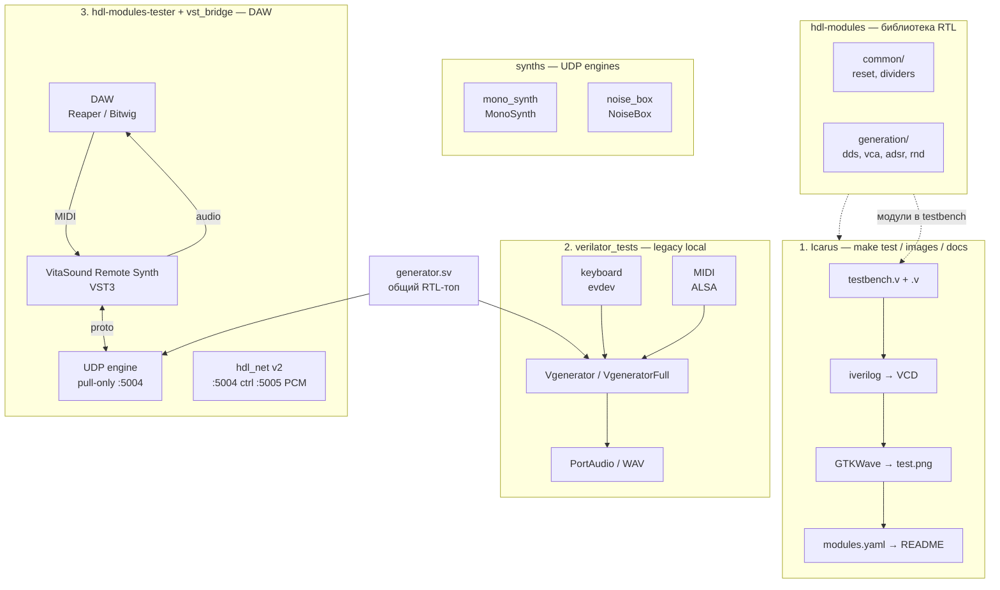
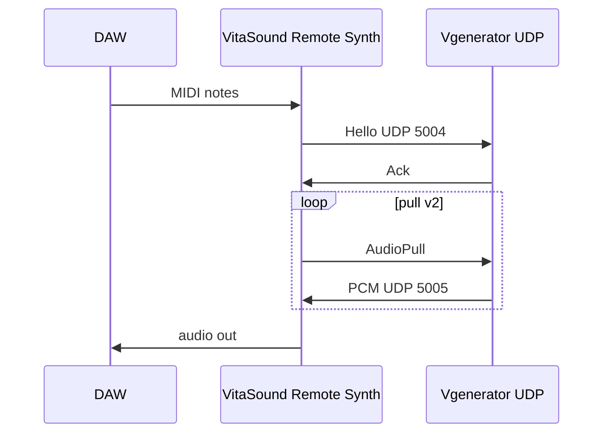

# Архитектура hdl-modules

Общая карта: библиотека RTL, симуляция в Icarus, реалтайм через Verilator и сетевой мост в DAW.



## Три уровня тестирования

| Уровень | Инструмент | Что проверяем | Артефакт |
|---------|------------|---------------|----------|
| **Модульный RTL** | Icarus Verilog | Один `.v` или пакет в изоляции | `test.png`, waveform в README |
| **Реалтайм на ПК** | Verilator + C++ (legacy) | MIDI/клавиатура → soundcard напрямую | `VgeneratorFull`, AXELVOX |
| **Через DAW** | VST3 + UDP engine | MIDI, ADSR CC, pitch bend | Reaper + `MonoSynth` |

## Legacy (`verilator_tests`)

Локальный синт: клавиатура / MIDI → soundcard / WAV. Без сети.

```bash
cd verilator_tests && make full
./obj_dir/VgeneratorFull --input-source midi --midi-port 32:0 --device-index 3 --sample-rate 48000
```

| Бинарник | MIDI | Pitch / CC |
|----------|------|------------|
| `Vgenerator` | Note On/Off | нет |
| `VgeneratorFull` | 0..127, highest note | pitch wheel **нет** |

| Ввод | Вывод | Назначение |
|------|-------|------------|
| `input_keyboard` | soundcard / WAV | PC-клавиатура, одна октава |
| `input_midi` | soundcard / WAV | MIDI-клавиатура (ALSA) |

Поток: **MIDI note** → `shared_state` (`gate`, `note`) → **Verilog** → **PCM** → PortAudio.

Полный голос (`mono_voice`) + ADSR: [`synths/mono_synth/`](../synths/mono_synth/README.md).

## UDP synths (`synths/`)

| Engine | RTL | Запуск |
|--------|-----|--------|
| [`mono_synth`](synths/mono_synth/README.md) | `mono_voice` + MIDI-регистры | `./scripts/run_mono_synth.sh` |
| [`noise_box`](synths/noise_box/README.md) | `rndx` шум | `./scripts/run_noise_box.sh` |

На порту **5004** одновременно один engine. Протокол v3: `MidiHostToEngine` (raw MIDI bytes), `AudioPull`.

## UDP engine (`hdl-modules-tester`)

Только сеть: HDL клокается **только** на `AudioPull` от VST host.

```bash
./scripts/run_udp_engine.sh          # engine в WSL/Linux
# VST: Engine host = IP WSL или 127.0.0.1 (native engine)
```



Подробнее: [hdl-modules-tester/README.md](hdl-modules-tester/README.md), [vst_bridge/README.md](vst_bridge/README.md), [docs/WSL_NETWORKING.md](docs/WSL_NETWORKING.md).

## Где что лежит

| Путь | Роль |
|------|------|
| `common/`, `dds/`, `vca/`, … | Исходники RTL + `*_test/` |
| `modules.yaml` | Метаданные для `make docs` |
| `tools/run_tests.py`, `make test` | Запуск Icarus по всем модулям |
| `verilator_tests/generator.sv` | Legacy MVP-топ (одна октава) |
| `verilator_tests/generator_fullrange.sv` | Legacy MVP, полный MIDI |
| `verilator_tests/` | Legacy: keyboard/MIDI → soundcard/wav |
| `common/note_mono.v`, `lin2exp_t.v` | MIDI alloc / CC curve (fpga-synth) |
| `hdl-modules-tester/` | Общий UDP-стек для synths |
| `synths/mono_synth/` | MonoSynth: mono_voice + ADSR CC + VST |
| `synths/noise_box/` | NoiseBox: rndx 16-bit |
| `vst_bridge/` | VST3-плагин (хост в DAW) |
| `hdl-modules-tester/protocol/hdl_net.h` | Протокол UDP (копия в `vst_bridge/protocol/`) |

## Связь с будущей ПЛИС

Библиотека `hdl-modules` — источник блоков для VitaSound FPGA. Сейчас `generator.sv` в Verilator — упрощённый MVP; модули `dds`, `adsr`, `vca` отрабатываются в Icarus и постепенно войдут в полный синтезатор на железе и в Verilator-top.
