# hdl-modules

Репозиторий, в котором будут собраны все модули

Наработки постепенно переосмысливаются и переносятся из [fpga-synth](https://github.com/UA3MQJ/fpga-synth)

**Схема проекта:** [ARCHITECTURE.md](ARCHITECTURE.md) — RTL-библиотека, Icarus-тесты, legacy `verilator_tests` (клавиатура/MIDI/звук) и `hdl-modules-tester` + VST (UDP/DAW).

# назначение модулей

## Common

[Модули общего назначения и вспомогательные](common/README.md)

| N | Module | Description | Img |
| - | ------ | --- | --- |
| 1 | powerup_reset | Генератор автоматического сигнала сброса и сброса по кнопке |  |
| 2 | frqdivmod | Целочисленный делитель частоты на 2, 3, 4 итд |  |
| 3 | strobe_gen | Формирователь строба шириной 1 clk от нч сигнала (например, от целочисленного делителя) |  |
| 4 | param_reg | Регистр параметра с записью по strobe wr (param_reg WIDTH; обёртки reg7 — MIDI CC, reg14 — ADSR A/D/R, pitch) | 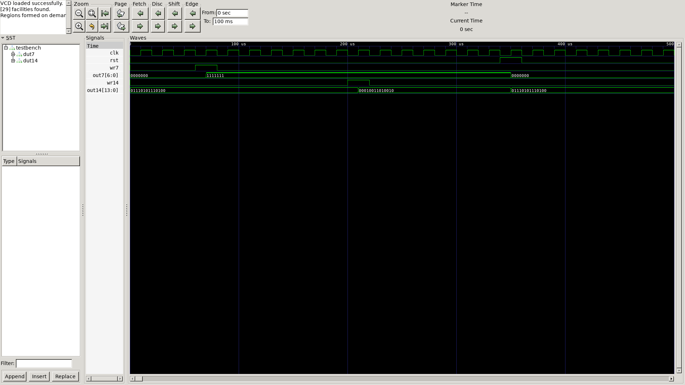 |
| 5 | reg_sr | SR-регистр gate: set (NoteOn) / reset (NoteOff); замена legacy reg_rs | 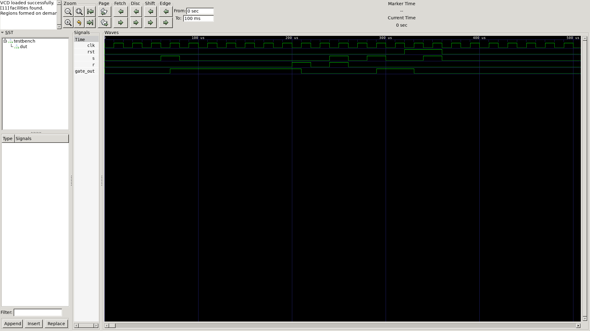 |

## I/O (граница ПЛИС)

[Интерфейсы с внешним миром; к модулям обычно прилагается внешняя схема (опторазвязка MIDI IN, ЦАП)](io/README.md)

| N | Module | Description | Img |
| - | ------ | --- | --- |
| 1 | midi_in | MIDI byte parser: channel voice → ch_message/lsb/msb; SysEx skip (v1); UART — на плате | 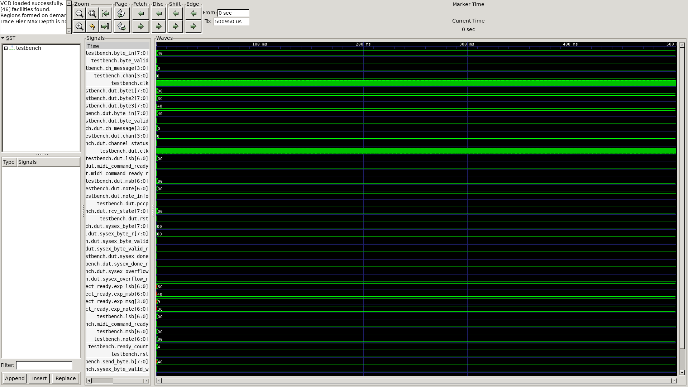 |

Генерация

| N | Module | Description | Img |
| - | ------ | --- | --- |
| 1 | [dds](dds/README.md) | Генератор базовой цифровой пилы | 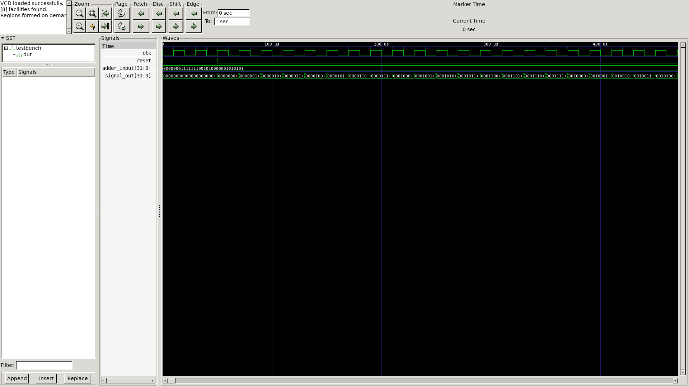 |
| 2 | [note2dds]() | MIDI note → DDS phase increment; таблица 12 semitones, параметр CLK_HZ | 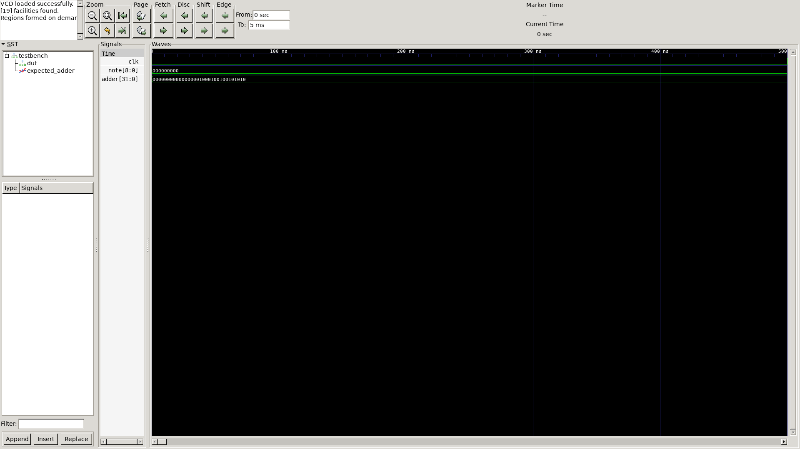 |
| 3 | [note_pitch2dds]() | Note + pitch wheel + LFO pitch → DDS adder (dual note2dds + interp) | 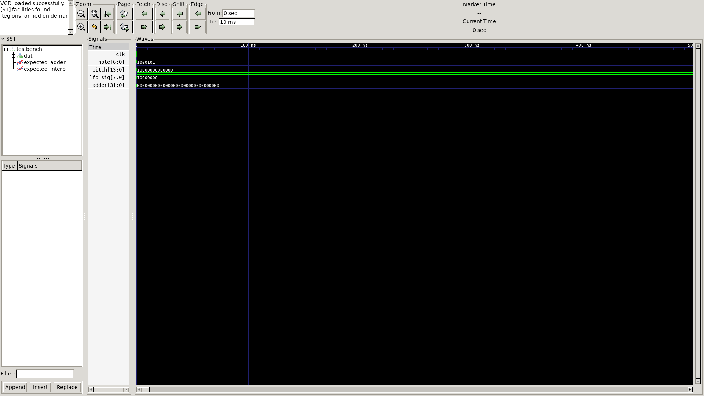 |
| 4 | [mono_voice](mono_voice/README.md) | Моно-голос: note_pitch2dds → dds → mux форм → adsr → vca; OUT_WIDTH параметр (дефолт 16) | 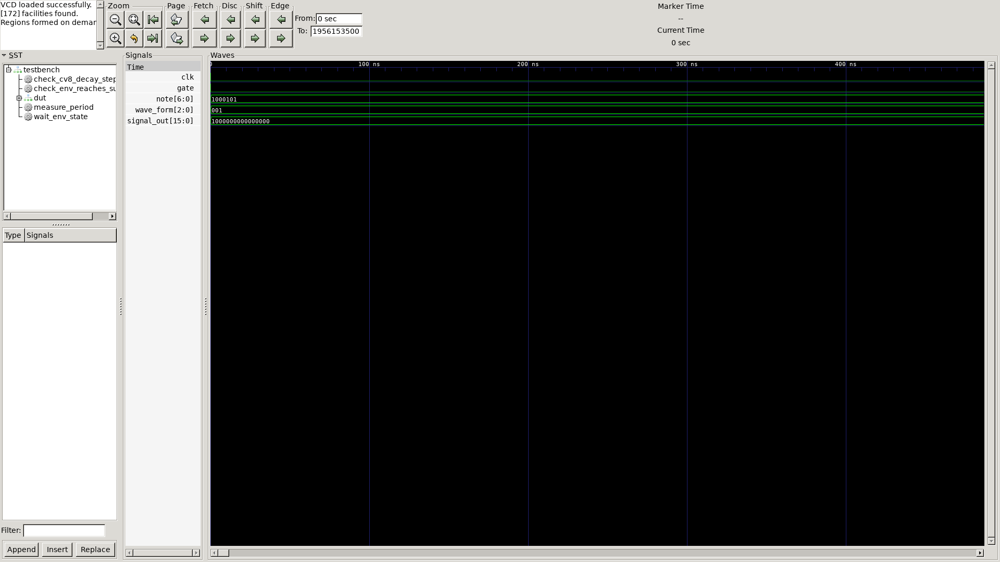 |
| 5 | [dds_transform](dds_transform/README.md) | Преобразователи формы базовой цифровой пилы и синус <br><br> [dds2saw.v](dds_transform/dds2saw.v) - пила <br> [dds2revsaw.v](dds_transform/dds2revsaw.v) - обратная пила <br> [dds2tria.v](dds_transform/dds2tria.v) - треугольник <br> [dds2square.v](dds_transform/dds2square.v) - меандр <br> [dds2pwm.v](dds_transform/dds2pwm.v) - PWM c 7-битной регулировкой % <br> [dds2sin.v](dds_transform/dds2sin.v) - синус (WIDTH, LUT_BITS; дефолт 32×8 точек) <br> | 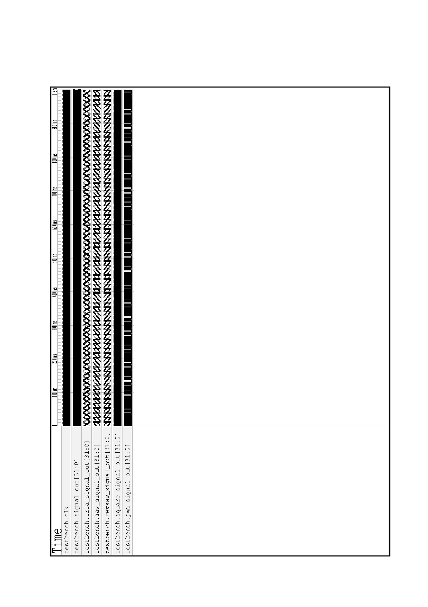 |
| 6 | [vca](vca/README.md) | Модули VCA. 8 и 32 битные. Формат данных целочисленный без знака. То есть от 0 до N с центром в N/2. <br><br> [svca.v](vca/svca.v) - vca 8bit cv, in, out <br> [svca_wide.v](vca/svca_wide.v) - vca 8bit cv, in, 16bit out <br> [svca32.v](vca/svca32.v) - vca 32 bit cv, in, out <br> | 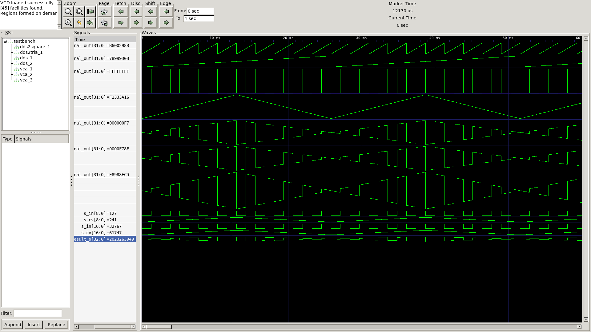 |
| 7 | [rnd](rnd/README.md) | Модули генерации псевдослучайных чисел 1, 8, n бит. <br><br> [rnd1.v](rnd/rnd1.v) - rnd 1bit <br> [rnd8.v](rnd/rnd8.v) - rnd 8 bit <br> [rndx.v](rnd/rndx.v) - rnd x bit (1..32) <br> | 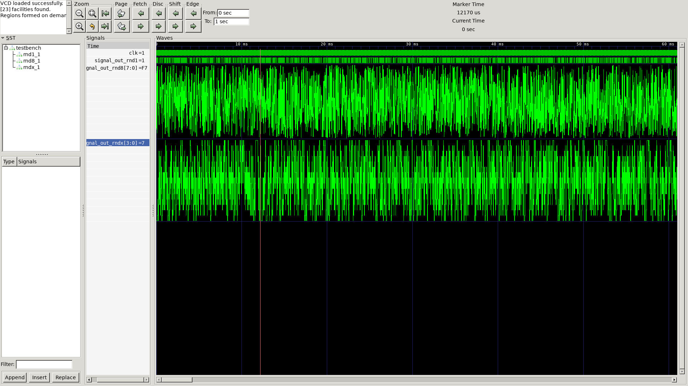 |
| 8 | [adsr](adsr/README.md) | Генератор огибающей ADSR |  |
| 9 | [svf](svf/README.md) | Цифровой state-variable фильтр Chamberlin: HP, BP, LP, BR за один `tick`.
Коэффициенты: `f = 2·sin(π·Fc/Fs)`, `q = 1/Q` (signed 18-bit, Q17 в умножениях).
Вход 12-bit signed; выходы 18-bit. Рекомендуется `Fc < Fs/6` при высоком Q.
Теория резонанса: [Katjaas — Complex Resonator](https://www.katjaas.nl/complexintegrator/complexresonator.html).
Демо на слух (~20 с, LP/HP/BP/BR, разные Fc и Q): `make svf-demo` → `svf/test/demo.wav`.
 | 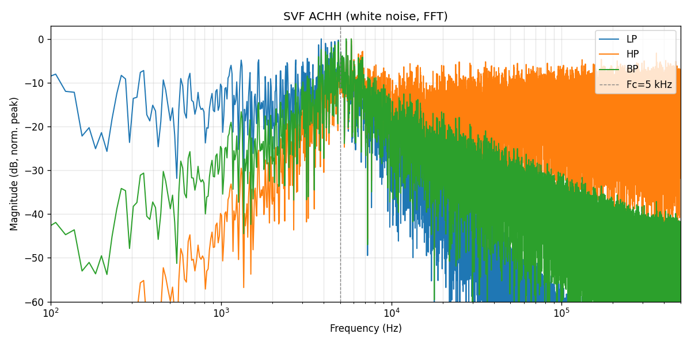 |

# окружение

Все модули разработаны и протестированы в icarus verilog

https://iverilog.fandom.com/wiki/Installation_Guide#Ubuntu_Linux

для просмотра gtkwave

## Автоматизация

```bash
make test      # запустить все симуляции
make images    # сгенерировать waveform PNG
make docs      # обновить README из modules.yaml
make all       # test → images → docs
```

Как добавить новый модуль: [docs/ADDING_MODULES.md](docs/ADDING_MODULES.md)

Зависимости: [docs/DEPENDENCIES.md](docs/DEPENDENCIES.md)

## VitaSound Remote Synth (DAW ↔ Verilator)

Плагин VST3 и UDP-engine для Reaper / других DAW:

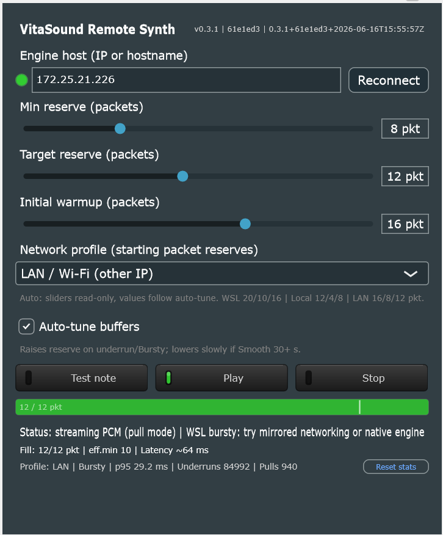

- VST: [vst_bridge/README.md](vst_bridge/README.md) — сборка `vst_bridge/scripts/build_windows_mingw.sh` (Win) или `build_linux.sh` (Linux)
- Engine: [hdl-modules-tester/README.md](hdl-modules-tester/README.md) — `make` или `hdl-modules-tester/scripts/build_windows_mingw.sh`
- Сеть WSL: [docs/WSL_NETWORKING.md](docs/WSL_NETWORKING.md)

# sandbox

песочница со всем подряд

самый первый сайт

https://sites.google.com/site/analogsynthdiy/sobstvennye-razrabotki/sintezator-na-baze-plis/z---ssylki

# заметки

sudo apt-get install libasound-dev portaudio19-dev libportaudio2 libportaudiocpp0

sudo apt-get install libasound-dev verilator

sudo apt install --reinstall alsa-base alsa-utils

<!-- generated by tools/gen_readme.py -->
