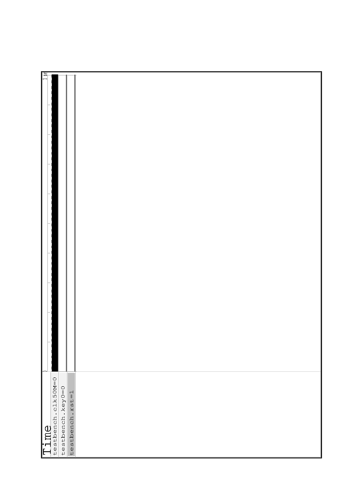
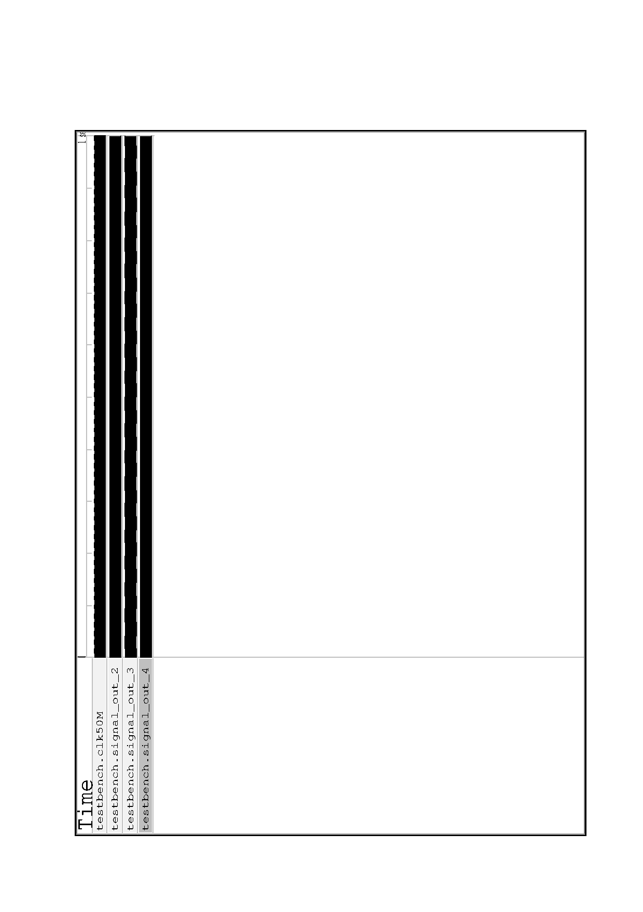
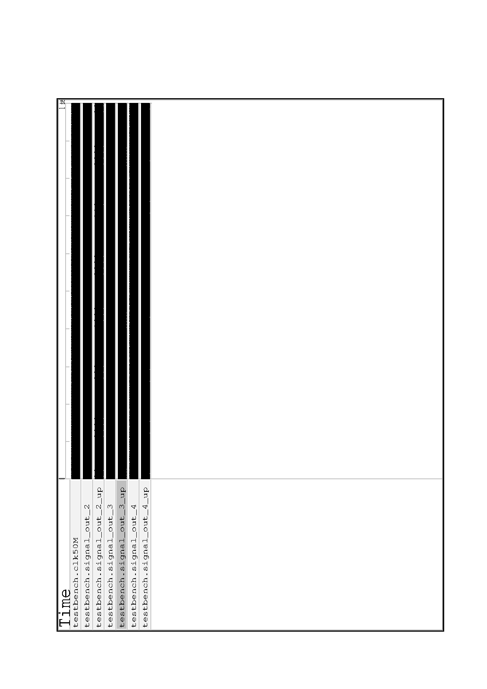

# Common modules

Модули общего назначения

| N | Module | Description | Img |
| - | ------ | --- | --- |
| 1 | powerup_reset | Генератор автоматического сигнала сброса и сброса по кнопке |  |
| 2 | frqdivmod | Целочисленный делитель частоты на 2, 3, 4 итд |  |
| 3 | strobe_gen | Формирователь строба шириной 1 clk от нч сигнала (например, от целочисленного делителя) |  |

<!-- generated by tools/gen_readme.py -->
