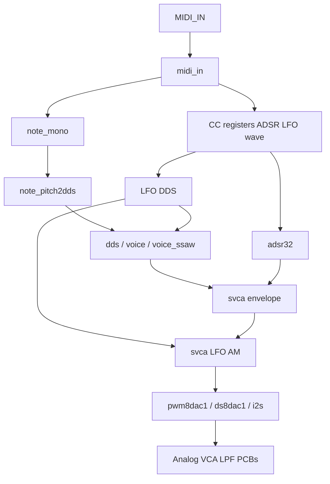

# План переноса из legacy (fpga-synth → hdl-modules)

Источник legacy: [UA3MQJ/fpga-synth](https://github.com/UA3MQJ/fpga-synth) — первый этап разработки FPGA-модульного синтезатора.

Целевой репозиторий: **hdl-modules** (VitaSound) — актуализированные модули, Icarus-тесты, Verilator «на слух», VST по UDP.

---

## 1. Что такое fpga-synth

| Аспект | Описание |
|--------|----------|
| Язык | Verilog (`.v`), без SystemVerilog |
| Назначение | Модульная библиотека RTL + готовые Quartus-проекты под Altera Cyclone II/IV |
| Документация | [GitHub wiki](https://github.com/UA3MQJ/fpga-synth/wiki); в репо — однострочный README |
| Аналог | PCB в `schemes/` (VCA, LPF/VCF, MIDI in, питание) — FPGA даёт PWM/CV, аналог фильтрует и усиливает |
| Тесты | `benches/` — Icarus + `makev.bat`, без единого `make all` |
| Симуляция tops | Почти нет — ориентация на синтез и железо |

### Структура каталогов fpga-synth

```
fpga-synth/
  modules/          # Каноническая библиотека RTL
  benches/          # Unit-тесты Icarus
  examples/         # Quartus-проекты (VitaPoly*, EP2C5, YM2149f, …)
  schemes/          # Altium — аналоговые платы
  Samples/          # WAV/ROM для барабанов и эталонных волн
  ModuleTester/     # Bring-up платы (счётчик)
  wiki/             # Заглушка; основная дока на GitHub
```

---

## 2. Архитектура голоса в fpga-synth (VitaPoly)



**MIDI CC (типично):**

| CC | Назначение |
|----|------------|
| 16–19 | ADSR (A, D, S, R) |
| 48 | Форма волны |
| 49–53 | LFO / detune |
| 54+ | VREF / CV фильтра |

### Главные tops (не переносить как есть)

| Top | Роль |
|-----|------|
| `examples/VitaPolySimple/VitaPolySimple.v` | Моно: voice + LFO AM + ADSR + PWM |
| `examples/VitaPolyOne/` | Supersaw + drums (ROM) + analog VCA CV |
| `examples/EP2C5/` | Орган, I2S DAC, YM2149 на шине |
| `examples/YM2149f/` | Эмуляция AY-3-8910 / YM2149 |

**VitaPolySimple** — лучший референс для будущего `synths/mono_voice/`.

---

## 3. Библиотека `modules/` в fpga-synth

### Осцилляторы и pitch

| Модуль | Назначение |
|--------|------------|
| `dds.v`, `dds32.v` | Phase accumulator (NCO) |
| `sin.v` | Таблица синуса |
| `note2dds.v` + `note2dds_1st..6st_gen.v` | ~~MIDI note → частота~~ → **`dds/note2dds.v`** (gens не переносить) |
| `note_pitch2dds.v` + `_1st..3st_gen.v` | ~~Note + pitch + LFO~~ → **`dds/note_pitch2dds.v`** (gens не переносить) |
| `note_mono.v` | Один голос: gate + last note |
| `note_mono_array.v`, `note_mono_harray.v` | Полифония (до 32 нот) |
| `frqdivmod.v` | Делитель частоты |
| `lin2exp.v`, `lin2exp_t.v` | Linear → exponential (MIDI CC) |

### Голос и синтез

| Модуль | Назначение |
|--------|------------|
| `voice.v` | Моно-голос: pitch→DDS, mux форм (saw/square/tri/sine/noise), LFO pitch |
| `voice_ssaw.v` | Supersaw: 7 detuned DDS |
| `adsr32.v` | 32-bit ADSR (FSM) |
| `svca.v` | Цифровой VCA (unsigned, центр 128) |
| `vca8.v`, `vca_pwm8dac1.v` | VCA + PWM CV для аналоговых плат |
| `rnd1.v`, `rnd8.v`, `rndx.v` | Генераторы шума |

### MIDI / регистры / утилиты

| Модуль | Назначение |
|--------|------------|
| `midi_in.v` | MIDI UART @ 50 MHz |
| `reg1/7/14/14w/32/rs.v` | Параметрические регистры (см. §4 — перенесены `param_reg`, `reg7`, `reg14`, `reg_sr`) |
| `powerup_reset.v` | Сброс по кнопке |
| `fifo.v`, `spi_slave.v` | FIFO, SPI |
| `signal_cross_domain.v`, `flag_cross_domain.v` | CDC |
| `bitscan.v`, `prio_encoder.v`, `bitops_*` | Битовые операции |

### DAC / аудиовыход

| Модуль | Назначение |
|--------|------------|
| `pwm8dac1.v`, `ds8dac1.v`, `fpga4fun_ds8dac1.v` | 8-bit PWM DAC |
| `rnd8dac1.v`, `udsdac1.v` | Альтернативные DAC |
| `i2s_receive2.v` | I2S приём |

---

## 4. Что уже перенесено в hdl-modules

Источник правды по тестам: [`modules.yaml`](../modules.yaml), `make test`.

| fpga-synth (`modules/`) | hdl-modules | Статус |
|-------------------------|-------------|--------|
| `frqdivmod.v` | [`common/frqdivmod.v`](../common/frqdivmod.v) | Перенесён, + Icarus test, PNG |
| `powerup_reset.v` | [`common/powerup_reset.v`](../common/powerup_reset.v) | Перенесён, + тест |
| — | [`common/strobe_gen.v`](../common/strobe_gen.v) | **Новый** (не было в fpga-synth) |
| `reg7.v`, `reg14w.v` | [`common/param_reg.v`](../common/param_reg.v), [`reg7.v`](../common/reg7.v), [`reg14.v`](../common/reg14.v) | Параметрическое ядро + обёртки 7/14 bit; опциональный `rst` |
| `reg_rs.v` | [`common/reg_sr.v`](../common/reg_sr.v) | Sync SR gate (set/reset); при `s&&r` — reset wins |
| `dds.v` | [`dds/dds.v`](../dds/dds.v) | Перенесён, добавлен `reset` |
| waveform mux в `voice` | [`dds_transform/`](../dds_transform/) | **Новая упаковка**: saw, revsaw, tri, square, pwm, **sin** ([`dds2sin.v`](../dds_transform/dds2sin.v)) |
| `svca.v` | [`vca/svca.v`](../vca/svca.v) | Перенесён |
| — | [`vca/svca32.v`](../vca/svca32.v), [`svca_wide.v`](../vca/svca_wide.v) | Расширения |
| `rnd1.v`, `rnd8.v`, `rndx.v` | [`rnd/`](../rnd/) | Перенесены |
| `adsr32.v` | [`adsr/adsr.v`](../adsr/adsr.v) | Переработан под новый стиль |
| `sin.v` | [`dds_transform/dds2sin.v`](../dds_transform/dds2sin.v) | 8-точечный LUT + симметрия; учебный путь: [`sandbox/Sine_tab/`](../sandbox/Sine_tab/) |

**Не перенесены (reg*):** legacy split-write `reg14` (`wr_lsb`/`wr_msb`), `reg32` (покрывается `param_reg #(32)`), `reg1` (async latch).

### Runtime (не в `modules.yaml`, но в репо)

| Назначение | Путь | Связь с fpga-synth |
|------------|------|-------------------|
| MVP square osc | [`verilator_tests/generator.sv`](../verilator_tests/generator.sv) | Упрощённый placeholder вместо `voice` |
| Шум 16-bit | [`synths/noise_box/`](../synths/noise_box/) | Использует `rndx` — первый synth по паттерну `synths/*` |
| UDP engine | [`hdl-modules-tester/`](../hdl-modules-tester/) | Замена `midi_in` + PWM: MIDI/PCM через VST |
| VST мост | [`vst_bridge/`](../vst_bridge/) | Нет аналога в fpga-synth |
| Legacy local | [`verilator_tests/`](../verilator_tests/) | Keyboard/MIDI → soundcard (отладка без DAW) |

---

## 5. Что ещё не перенесено

### Высокий приоритет (для моно-голоса)

| fpga-synth | Зачем | Куда в hdl-modules |
|------------|-------|-------------------|
| ~~`note2dds.v`~~ | MIDI note → adder | **`dds/note2dds.v`** ✓ |
| ~~`note_pitch2dds.v`~~ | Pitch/LFO → adder | **`dds/note_pitch2dds.v`** ✓ |
| ~~`voice.v` (логика)~~ | Сборка OSC+wave+ADSR+VCA | **`mono_voice/mono_voice.v`** ✓ |
| `adsr32` → уже есть `adsr.v` | Огибающая | подключено в `mono_voice` |

### Средний приоритет

| fpga-synth | Зачем |
|------------|-------|
| `note_mono`, `note_mono_*array` | Полифония в RTL (сейчас gate в `engine.cpp`) |
| `lin2exp.v` | Кривая для MIDI CC |

### Низкий приоритет / только для FPGA на железе

| fpga-synth | Зачем |
|------------|-------|
| `midi_in.v`, OpenCores UART | На ПЛИС — свой MIDI; в Verilator — VST |
| `pwm8dac1`, `ds8dac1`, `i2s_*` | PWM/I2S на пины платы |
| `vca_pwm8dac1` | CV на аналоговые платы [`schemes/`] |
| VitaPolyOne drums, YM2149, EP2C5 tops | Отдельные продукты |

### Не переносить

| Что | Почему |
|-----|--------|
| `examples/*/modules/` (копии библиотеки) | Дубли; источник — корневой `modules/` |
| Quartus `.qsf`, `.rpt`, PLL wrappers | Привязка к Altera |
| `sandbox/www.fpga.synth.net/` в hdl-modules | Архив, не часть VitaSound pipeline |

---

## 6. Сравнение подходов

| | fpga-synth | hdl-modules |
|---|------------|-------------|
| **Тест модуля** | `benches/`, ручной iverilog | `make test`, PNG, `modules.yaml` |
| **Отладка на слух** | Только на плате | Verilator legacy → UDP → VST |
| **MIDI** | `midi_in` на FPGA | DAW → VST → UDP |
| **Аудиовыход** | PWM → аналог | PCM в DAW / WAV |
| **Такт** | 50 MHz на плате | 1 MHz в Verilator, pull от VST host |
| **Сборка голоса** | `VitaPolySimple.v` top | `synths/<name>/` + shared `hdl-modules-tester` |
| **Цель** | ПЛИС + analog modular | Библиотека + софт-прототип → будущая ПЛИС |

---

## 7. Паттерн переноса одного модуля

1. Взять `.v` из `fpga-synth/modules/`.
2. Привести к стилю hdl-modules (параметры, `reset` где нужно, имена портов).
3. Добавить `*_test/testbench.v`, `test.sh`, `test.gtkw`.
4. Запись в [`modules.yaml`](../modules.yaml).
5. `make sim ID=<id>` → `make images` → `make docs` → `make all`.
6. При необходимости — включить в `synths/*/top.sv`.

**Не копировать** несколько поколений (`note2dds_3st_gen`, …) — выбрать одну финальную или объединить.

---

## 8. Паттерн нового синта (`synths/`)

Уже реализовано на примере [`synths/noise_box/`](../synths/noise_box/):

```
synths/<name>/
  top.sv              # Verilator top
  synth_core.cpp/h    # RTL → PCM (Vnoise_*)
  main.cpp
  Makefile            # + ../../hdl-modules-tester/{engine,net_socket}.cpp
```

- UDP и протокол — **общие** ([`hdl-modules-tester/`](../hdl-modules-tester/)).
- VST — **один** ([`vst_bridge/`](../vst_bridge/)); меняется только запущенный бинарник.
- Порт **5004** — один engine за раз.

См. также [`synths/README.md`](../synths/README.md), [`ARCHITECTURE.md`](../ARCHITECTURE.md).

---

## 9. Дорожная карта переноса

### Фаза A — сделано

- [x] Common: `frqdivmod`, `powerup_reset`, `strobe_gen`, `param_reg`/`reg7`/`reg14`, `reg_sr`
- [x] Generation: `dds`, `dds_transform`, `vca`, `rnd`, `adsr`
- [x] Verilator MVP + legacy local + UDP tester + VST
- [x] `synths/noise_box` (rndx 16-bit)

### Фаза B — моно-голос (следующий шаг)

- [x] `note2dds.v` — MIDI note → DDS adder; таблица 12 semitones в Verilog (`initial for`, параметр `CLK_HZ`)
- [x] `note_pitch2dds.v` — note + pitch wheel + LFO → dual `note2dds` + linear interp; Icarus self-check
- [x] `mono_voice/` — `note_pitch2dds` → `dds` → mux `dds2*` → `adsr` → `svca_wide`; `OUT_WIDTH` default 16; тест A4 440 Hz
- [x] `synths/mono_synth/` — Verilator + UDP (`MonoSynth`), `note_mono`, ADSR CC 16–19, wave CC 48, pitch bend
- [x] `verilator_tests/VgeneratorFull` — legacy MIDI 0..127 без VST (ALSA → PortAudio)
- [x] Common: `note_mono`, `lin2exp_t`, `bitscan`, `prio_encoder` (из fpga-synth)
- [x] HDLNet: `ControlChange`, `PitchBend`; VST forward CC/pitch
- [ ] Референс wiring в FPGA-top: `fpga-synth/examples/VitaPolySimple/VitaPolySimple.v`

**Не переносить:** `note2dds_1st..6st_gen.v`, `.mif`, `note_pitch2dds_1st..3st_gen.v`, копии в `examples/*/modules/`.

**Supersaw (`voice_ssaw`) — фаза C:** RTL остаётся в fpga-synth; для `note_pitch2dds` достаточно LFO tie-off (`lfo_sig=128`, depth=0).

### Фаза C — расширения

- [ ] `voice_ssaw` / duo → `synths/duo/` или полифония в RTL
- [ ] LFO AM (как в VitaPolySimple)
- [x] Параметры ADSR/wave по UDP (CC 16–19, 48; pitch bend)
- [ ] Legacy local: pitch wheel в `VgeneratorFull`

### Фаза D — FPGA prod (долгосрочно)

- [ ] Вернуть `pwm8dac1` / I2S для целевой платы VitaSound
- [ ] `midi_in` или USB-MIDI на железе
- [ ] Интеграция с `schemes/` (analog chain)

---

## 10. Где смотреть в fpga-synth

| Цель | Путь |
|------|------|
| Референс моно-синта | `examples/VitaPolySimple/VitaPolySimple.v` |
| Голос целиком | `modules/voice.v` |
| MIDI → частота | `modules/note_pitch2dds.v` |
| Сравнить ADSR | `modules/adsr32.v` ↔ `hdl-modules/adsr/adsr.v` |
| Старые unit-тесты | `benches/` |
| Аналоговая часть | `schemes/` |
| Документация | https://github.com/UA3MQJ/fpga-synth/wiki |

---

## 11. Связанные документы в hdl-modules

- [ARCHITECTURE.md](../ARCHITECTURE.md) — три пути: Icarus, legacy, UDP
- [AGENTS.md](../AGENTS.md) — правила для агента и пайплайн
- [docs/ADDING_MODULES.md](ADDING_MODULES.md) — как добавить модуль в библиотеку
- [synths/README.md](../synths/README.md) — паттерн synths/*
- [hdl-modules-tester/README.md](../hdl-modules-tester/README.md) — UDP engine
- [vst_bridge/README.md](../vst_bridge/README.md) — VST3

---

*Документ составлен по исследованию репозитория `/home/sea/fpga-synth` и текущего состояния hdl-modules.*
