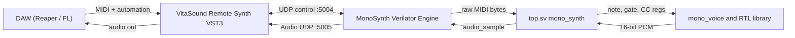
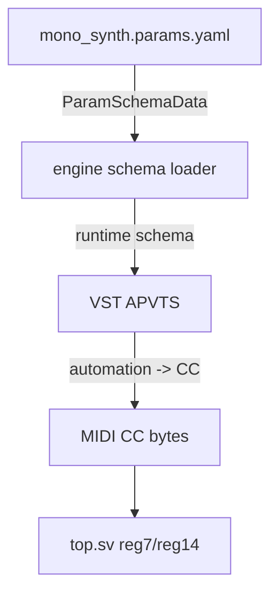
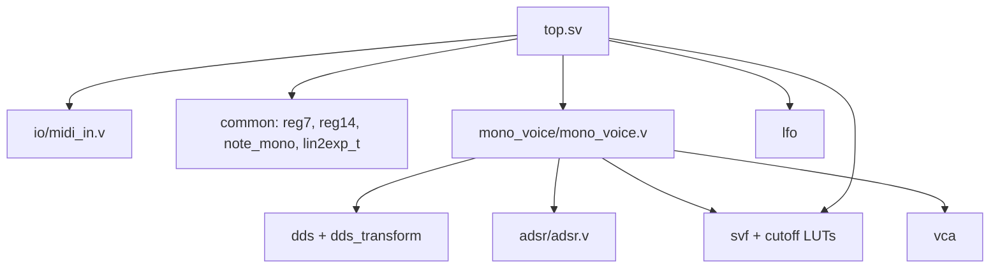
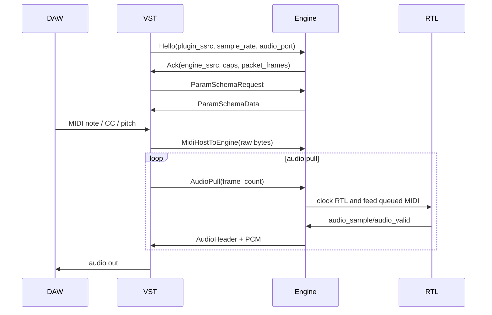

# mono_synth schema

Любое новое поле, сообщение, MIDI CC или RTL port сначала фиксируется здесь, затем в коде, затем в [`edge-cases.md`](edge-cases.md), если появляется нетипичное поведение.

Этот файл описывает happy-path контракты данных и обмена. Отклонения, ошибки и пустые состояния описаны в [`edge-cases.md`](edge-cases.md).

## Структуры С Полями

### UDP / hdl_net v5

Источник правды: [`hdl_net.h`](../../../hdl-modules-tester/protocol/hdl_net.h).

| Структура | Ключевые поля | Назначение |
|-----------|---------------|------------|
| `ControlHeader` | `magic`, `version`, `type`, `payload_len`, `seq` | Заголовок control packet на UDP `:5004` |
| `HelloPayload` | `sample_rate`, `block_size`, `plugin_ssrc`, `audio_port`, `session_mode`, `packet_frames`, `initial_warmup_packets`, `min_reserve_packets`, `target_reserve_packets` | VST начинает или обновляет session |
| `AckPayload` | `sample_rate`, `engine_ssrc`, `packet_frames`, `max_frames_per_pull`, `caps` | Engine подтверждает session и capabilities |
| `AudioPullPayload` | `request_id`, `frame_count`, `host_fill`, `host_target` | VST запрашивает PCM frames |
| `MidiPayloadHeader` | `timestamp_us`, `length` + raw MIDI bytes | MIDI host -> engine |
| `ParamSchemaPayloadHeader` | `hash`, `length` + schema bytes | Runtime params schema |
| `AudioHeader` | `magic`, `version`, `seq`, `timestamp_us`, `frame_count`, `channels` | Заголовок PCM packet на UDP `:5005` |

Пакеты на wire используют big-endian helpers `hostToBe*` / `beToHost*` из `hdl_net.h`.

### Params Schema

Источник: [`mono_synth.params.yaml`](../mono_synth.params.yaml).

| Поле | Значение | Используется |
|------|----------|--------------|
| `schema_version`, `id`, `title` | Метаданные synth schema | Engine schema response, VST cache |
| `midi_channel` | MIDI channel для параметров | VST/host mapping |
| `id`, `name`, `group` | Имя параметра | APVTS / CtrlrX / UI |
| `type: cc7` | `cc`, `default`, `min`, `max` | 7-bit CC -> `reg7` или `lin2exp_t` |
| `type: cc14_log` | `cc_lsb`, `cc_msb`, `default`, `min`, `max` | 14-bit cutoff -> `fcut14` |
| `type: choice` | `choices`, `midi_values` | Waveform, filter mode, LFO shape |

Не придумывать CC-номера из UI. Сверять с [`../../../docs/MONO_SYNTH_MIDI.md`](../../../docs/MONO_SYNTH_MIDI.md) и `top.sv`.

### RTL Integration

| Сигнал / регистр | Width | Источник | Потребитель |
|------------------|-------|----------|-------------|
| `byte_valid`, `byte_in` | 1, 8 | `synth_core` raw MIDI queue | `midi_in` |
| `ch_message`, `lsb`, `msb` | 4, 7, 7 | `midi_in` | CC/pitch/note event decode |
| `gate`, `active_note` | 1, 7 | `note_mono` | `mono_voice`, filter envelope |
| `pitch14` | 14 | MIDI pitch bend, CC121 reset | `mono_voice` -> `note_pitch2dds` |
| `attack14`, `decay14`, `release14` | 14 | CC16/17/19 via `lin2exp_t` | VCA ADSR in `mono_voice` |
| `sustain7` | 7 | CC18 | VCA ADSR in `mono_voice` |
| `fcut14` | 14 | CC74/106, CC121 reset | `svf_fcut_mix` |
| `fcut14_eff` | 14 | manual cutoff + key follow + VCF LFO + filter env | `svf_cutoff14_to_f` |
| `fres_cc` | 7 | `127 - CC71` | `svf_cc_to_q` |
| `svf_mode` | 2 | CC22 high bits | `mono_voice` SVF mux |
| `vco_lfo_sig`, `vca_lfo_sig`, `vcf_lfo_sig` | 8 | `lfo` instances | pitch, tremolo, cutoff mix |
| `audio_sample`, `audio_valid` | 16, 1 | `mono_voice` | `synth_core` PCM packetizer |

## Связи

### System Links

### Params Ownership

### RTL Dependency Graph

## Сообщения

| Канал | Type / формат | Направление | Содержимое |
|-------|---------------|-------------|------------|
| UDP `:5004` | `Hello` | VST -> engine | `sample_rate`, `plugin_ssrc`, `audio_port`, reserve/packet settings |
| UDP `:5004` | `Ack` | engine -> VST | `engine_ssrc`, `packet_frames`, `max_frames_per_pull`, `caps` |
| UDP `:5004` | `Ping` / `Pong` | both | Liveness |
| UDP `:5004` | `MidiHostToEngine` | VST -> engine | `MidiPayloadHeader` + raw MIDI bytes |
| UDP `:5004` | `AudioPull` | VST -> engine | `request_id`, `frame_count`, host buffer state |
| UDP `:5004` | `ParamSchemaRequest` / `ParamSchemaData` | VST <-> engine | Runtime parameter schema |
| UDP `:5005` | `AudioHeader` + PCM | engine -> VST | int16 audio frames |
| MIDI | Note On/Off `0x9` / `0x8` | host -> `midi_in` | note, velocity |
| MIDI | CC `0xB` | host -> `top.sv` | cc number, value |
| MIDI | Pitch bend `0xE` | host -> `pitch14` | 14-bit pitch value |
| MIDI | Sys realtime Stop `0xFC` | host -> `note_mono` | all-notes-off path |

### Session Sequence

## Ограничения

| Ограничение | Значение | Где enforced |
|-------------|----------|--------------|
| Protocol magic control | `HDLM` / `0x48444C4D` | `hdl_net.h` |
| Protocol magic audio | `HDLA` / `0x48444C41` | `hdl_net.h` |
| Protocol version | `5` | `hdl_net.h` strict parsing |
| Control port | `5004` | engine bind / VST target |
| Audio port | `5005` default | `HelloPayload.audio_port` |
| RTL sample rate | `44100` | `top.sv AUDIO_HZ` |
| RTL clock | `1_000_000` Hz | `top.sv CLK_HZ` |
| Max MIDI bytes | `1024` | `kMaxMidiBytes` |
| Max audio packet frames | `256` | `kMaxAudioFrames` |
| Max frames per pull | `2048` default | `kDefaultMaxFramesPerPull` |
| Max audio channels | `2` | `kMaxAudioChannels` |
| Param schema bytes | `60000` | `kMaxParamSchemaBytes` |
| Cutoff range | 10 Hz ... 20 kHz | `svf_cutoff14_to_f`, `svf_fcut_mix` |
| CC7 range | 0 ... 127 | MIDI / `reg7` |
| Pitch center | 8192 | `pitch14` init / CC121 |

Violations and fallback behavior belong in [`edge-cases.md`](edge-cases.md).

## Правила Обмена

1. **Session start:** VST sends `Hello`; engine replies `Ack`. Current engine may pulse RTL `rst` on session start; see `mono-001`.
2. **Clocking:** `mono_synth` advances in response to `AudioPull`; MIDI is queued in `synth_core` and consumed by the RTL byte input path.
3. **MIDI raw path:** engine transports raw bytes. Semantic decode happens in `midi_in` and `top.sv`.
4. **Params path:** engine reads `mono_synth.params.yaml` at startup and serves it via `ParamSchemaData`; RTL sees only resulting MIDI CC bytes.
5. **Audio path:** `mono_synth` is pull-only. `AudioPush` exists in hdl_net for other engines such as `mini_fx`, not for this synth path.
6. **Reconnect:** a new `Hello` starts/refreshes a session. Whether state should reset is an edge case (`mono-001`, `mono-002`).
7. **Byte order:** control/audio fields are big-endian on wire through `hostToBe*` helpers.
8. **Wire changes:** adding or changing packet fields requires protocol version review and sync with `vst_bridge/protocol/hdl_net.h`.

## Related Docs

- [`architecture.md`](architecture.md) — layers and ownership.
- [`edge-cases.md`](edge-cases.md) — non-happy-path behavior.
- [`../../../docs/MONO_SYNTH_MIDI.md`](../../../docs/MONO_SYNTH_MIDI.md) — complete MIDI CC map.
- [`links.md`](links.md) — curated sources before external search.
